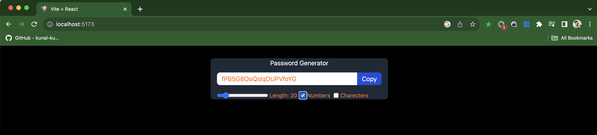
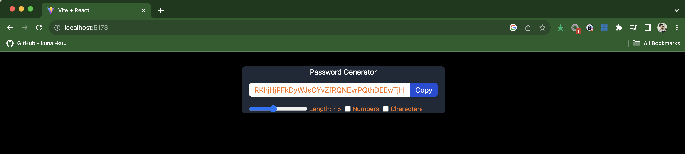
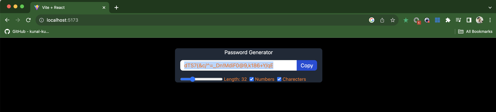

# 🔐 React Dynamic Password Generator

This React application empowers users to customize and generate passwords according to their preferences.

## Problem Statement

In today's digital age, cybersecurity is of paramount importance. One of the primary lines of defense in cybersecurity is a strong and unpredictable password. Many users often resort to using easily guessable passwords or reusing passwords across multiple platforms due to the challenges of remembering complex combinations. This practice makes them vulnerable to cyberattacks, where hackers can easily infiltrate accounts by merely guessing commonly used passwords.

**React Dynamic Password Generator** addresses this pressing issue. This application is designed to help users generate random, robust, and secure passwords for their accounts. By providing users with the ability to customize their password based on length, inclusion of numbers, and special characters, the application ensures that each generated password is both secure and tailored to the user's preferences.

Utilizing this tool adds an extra layer of security, ensuring that the user's passwords are not only strong but also unique. Keeping the password generation process anonymous ensures that the generated password remains confidential, further reducing the risk of potential cyber threats. In essence, the **React Dynamic Password Generator** acts as a shield, protecting users from the ever-growing threats in the digital world by equipping them with one of the most potent tools in cybersecurity: a robust password.

## Features

- **Dynamic Password Length**: Adjust the desired password length using an interactive scroller.
- **Customizable Characters**: Choose whether to include numbers and special characters for enhanced security.
- **Clipboard Functionality**: Easily copy the generated password with a single click.
- **React Concepts**: The app utilizes core React hooks such as `useState`, `useCallback`, `useEffect`, and `useRef` for optimized performance and user experience.

- **Built with love and React! ❤️**

## Technologies Used

- React (bootstrapped with Vite)
- Tailwind CSS for styling

## How to Run the Application

1. **Clone the repository**:
    ```bash
    git clone [https://github.com/sushilrajeeva/ReactPasswordGenerator]
    cd [ReactPasswordGenerator]
    ```

2. **Install the dependencies**:
    ```bash
    npm install
    ```

3. **Start the development server**:
    ```bash
    npm run dev
    ```

   The application should now be running on `http://localhost:3000/` (or your configured port).

4. **Build for production**:
    If you wish to create a production-ready build, use:
    ```bash
    npm run build
    ```

5. **Serve the production build**:
    After building for production, you can serve the app using:
    ```bash
    npm run serve
    ```

## Contribution

Feel free to fork this repository and submit pull requests. All contributions are welcome!

## License

This project is open-source.

## Screenshots





